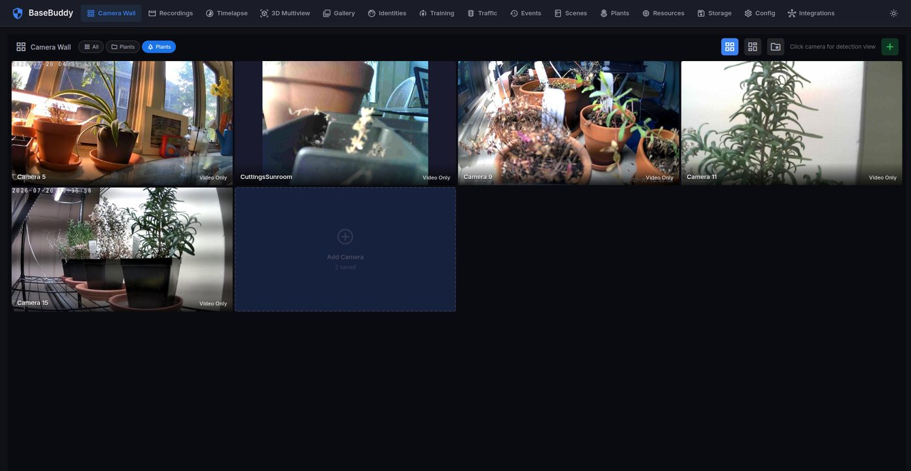
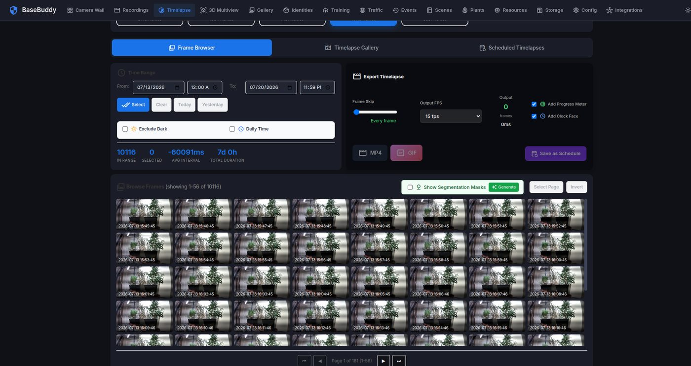
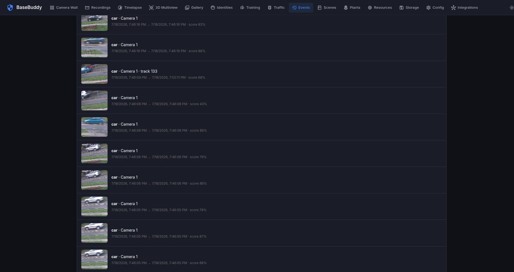
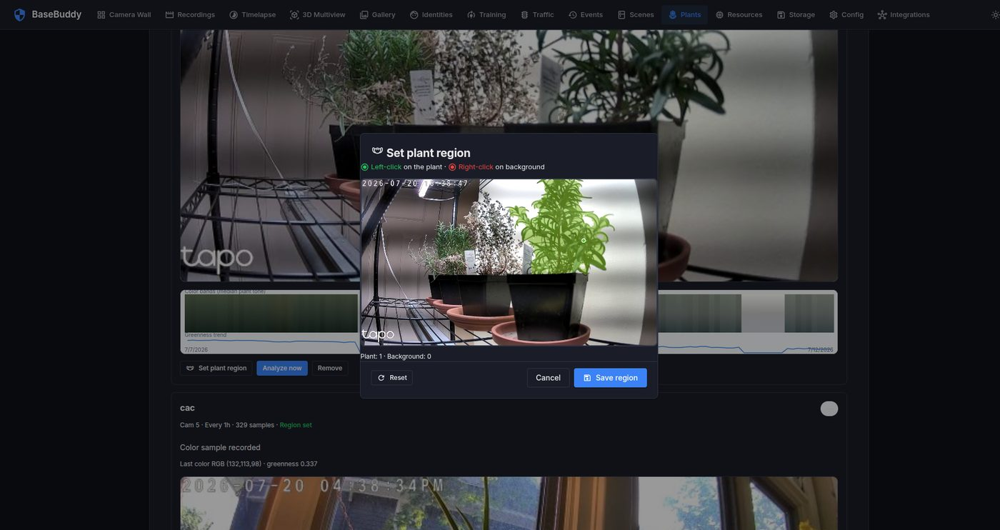
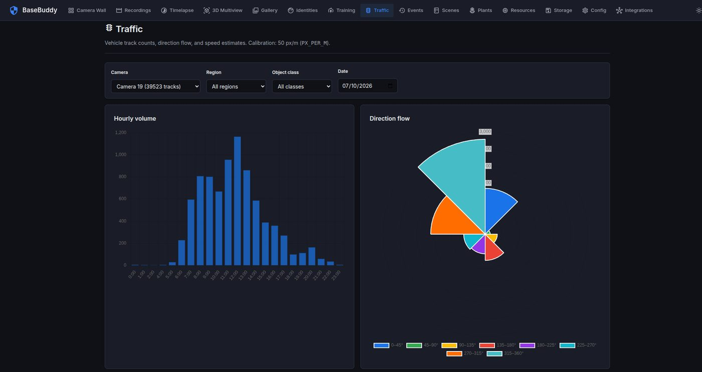

# BaseBuddy

AI-powered multi-camera surveillance with real-time object detection. Self-hosted, modular architecture with optional Docker deployment.

**Version**: 1.0.0  
**License**: MIT

## Screenshots

<table>
  <tr>
    <td align="center" width="33%">
      
      <br /><sub>Camera Wall — live multi-camera grid</sub>
    </td>
    <td align="center" width="33%">
      
      <br /><sub>Timelapse — browse frames &amp; export MP4/GIF</sub>
    </td>
    <td align="center" width="33%">
      
      <br /><sub>Events — detection timeline with scores</sub>
    </td>
  </tr>
  <tr>
    <td align="center" width="33%">
      
      <br /><sub>Plants — region setup &amp; health trends</sub>
    </td>
    <td align="center" width="33%">
      
      <br /><sub>Traffic — hourly volume &amp; direction flow</sub>
    </td>
    <td width="33%"></td>
  </tr>
</table>

---

## Quick Start

### 1. Install dependencies

```bash
python3 -m venv venv
source venv/bin/activate
pip install -r requirements.txt          # core + ML stack
# Or UI-only / no detection:
# pip install -r requirements-core.txt
```

### 2. Configure

```bash
cp env.example .env
# Edit .env (CAM1, CAM2, PORT, …)
# Or: cp config.example.txt config.txt
```

### 3. Run

```bash
./setup.sh          # first time only
./run.sh            # production launcher
./run.sh background # detached
./stop.sh
```

Open **http://localhost:5000** · Health check: **http://localhost:5000/health**

YOLO weights: **Config → Model weights**, or auto-download on first run.

---

## Docker

```bash
cp env.example .env
docker compose up -d
```

Runtime data (`recordings/`, `logs/`, …) is mounted from the repo root. See `docker-compose.yml`.

---

## Project structure

```
├── basebuddy/       Application source (app, core, modules, pages, templates, static)
├── docs/            Architecture, security, optional deps
├── scripts/         smoke_test.py
├── archive/         Legacy reference only (not used at runtime)
├── main.py          Entry shim
├── run.sh           Launcher
└── env.example      Configuration template
```

Details: [docs/ARCHITECTURE.md](docs/ARCHITECTURE.md) · [docs/SECURITY.md](docs/SECURITY.md) · [docs/OPTIONAL_DEPS.md](docs/OPTIONAL_DEPS.md)

---

## Configuration

See `env.example`. Production exposure beyond localhost:

```bash
AUTH_ENABLE=true
ADMIN_PASSWORD=change-me
SECRET_KEY=long-random-string
```

Optional ML packages: [docs/OPTIONAL_DEPS.md](docs/OPTIONAL_DEPS.md)

---

## Production deployment

1. Copy and lock down config:

```bash
cp env.example .env
chmod 600 .env
# Edit cameras, then for LAN/WAN exposure:
# AUTH_ENABLE=true  ADMIN_PASSWORD=...  SECRET_KEY=...
```

2. Install and verify:

```bash
./setup.sh
python scripts/smoke_test.py
./run.sh background
curl http://127.0.0.1:5000/health
```

3. Stop:

```bash
./stop.sh
```

Docker (CPU default, GPU optional):

```bash
docker compose up -d
docker compose -f docker-compose.yml -f docker-compose.gpu.yml up -d --build   # NVIDIA GPU
```

See [docs/SECURITY.md](docs/SECURITY.md) for production hardening (`AUTH_ENABLE`, secrets, CORS).

---

## Development

```bash
python scripts/smoke_test.py   # import + app factory (no cameras)
```

CI runs the same smoke test on push.

---

## Contributing

See [CONTRIBUTING.md](CONTRIBUTING.md).
